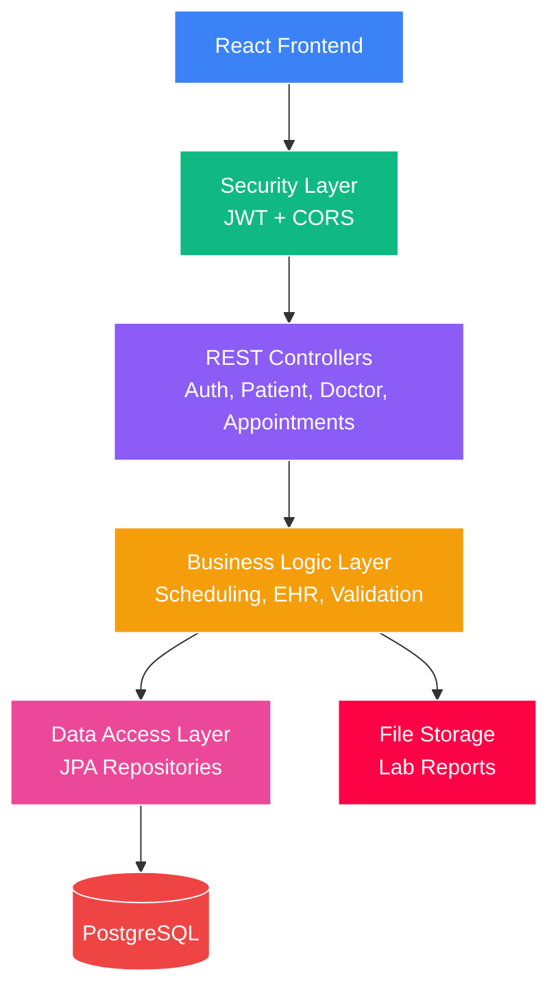

# MediSync - Smart Healthcare Appointment & Management System

A full-stack healthcare platform built with Spring Boot and React, demonstrating enterprise-level architecture, security best practices, intelligent scheduling algorithms, and modern frontend development.

[](https://www.oracle.com/java/)
[](https://spring.io/projects/spring-boot)
[](https://reactjs.org/)
[](https://www.postgresql.org/)

## Overview

MediSync is a comprehensive healthcare management system that streamlines the patient-doctor interaction through intelligent appointment scheduling, electronic health records, role-based access control, and secure data management. Built with a focus on security, scalability, and real-world applicability.

**What makes this project special:**
- **Full-stack implementation** - Spring Boot backend + React frontend with seamless integration
- **Production-ready security** - JWT authentication, BCrypt password hashing, CORS configuration
- **Smart scheduling algorithm** - Conflict detection, doctor availability validation, time slot calculation
- **Electronic Health Records** - Complete medical record system with prescriptions and lab reports
- **Clean architecture** - Separation of concerns with DTOs, services, and controllers
- **Modern UI/UX** - Responsive design with Tailwind CSS and React Router
- **Enterprise patterns** - Exception handling, audit logging, file upload/download
- **HIPAA-inspired compliance** - Data privacy, access control, secure endpoints

---

## Architecture


Check out the complete architecture diagram [here](architecture.md).

### Security Flow

```
Frontend Request → Axios Interceptor (adds JWT) → Backend JWT Filter → 
Authentication Check → Authorization Check → Controller → Service → Repository
```

### Scheduling Algorithm

```
Patient books appointment via UI
    ↓
Frontend: Fetch doctor's schedule
    ↓
Frontend: Show only working days in date picker
    ↓
Patient selects valid date
    ↓
Frontend: Fetch available time slots
    ↓
Patient selects time slot
    ↓
Backend: Validate doctor schedule exists for that day
    ↓
Backend: Check time is within working hours
    ↓
Backend: Query existing appointments for conflicts
    ↓
Backend: Detect time slot overlaps
    ↓
Accept or Reject with specific error
```

---

## Key Features

### 1. **Authentication & Authorization**
- JWT-based stateless authentication
- Secure user registration and login
- Role-based access control (PATIENT, DOCTOR, ADMIN, NURSE)
- Password encryption with BCrypt
- Token refresh mechanism
- Protected routes in frontend

### 2. **User Profile Management**
- Separate patient and doctor profiles
- Patient medical information (blood type, allergies, emergency contacts)
- Doctor professional details (specialization, license, qualifications)
- Profile update with validation
- Single table inheritance for efficient data modeling

### 3. **Appointment Management**
- **Patient features:**
  - Browse doctors by name and specialization
  - Visual date picker showing only available days
  - View available time slots in real-time
  - Book appointments with validation
  - View appointment history with status tracking
  - Cancel appointments
- **Doctor features:**
  - View patient appointments
  - Manage schedules
  - Create medical records after visits

### 4. **Smart Scheduling System**
- **Doctor availability schedules** - Doctors set working hours per day of week
- **Conflict detection** - Prevents double-booking automatically
- **Time slot calculation** - Shows available appointment slots in real-time
- **Business rule validation** - Ensures appointments are within working hours
- **Intelligent UI** - Date picker disables non-working days
- **Clear feedback** - Helpful error messages when booking fails

### 5. **Electronic Health Records (EHR)**
- **Medical records** - Visit documentation with diagnosis, symptoms, notes
- **Prescriptions** - Digital prescriptions with medication, dosage, frequency
- **Lab reports** - File upload/download with secure access control
- **Medical timeline** - Chronological view of patient's health journey
- **Audit trail** - Track who accessed records and when
- **Role-based access** - Doctors create, patients view their own

### 6. **File Management**
- Secure file upload for lab reports (PDF, images)
- Download with authentication checks
- Local storage with UUID filenames
- File metadata tracking (size, type, upload date)

---

## Technical Stack

### Backend
**Core Framework:**
- Spring Boot 3.x
- Spring Security (JWT)
- Spring Data JPA
- Spring Validation
- Spring AOP (for auditing)

**Database:**
- PostgreSQL 15
- Hibernate ORM
- JPA Auditing

**Security:**
- JSON Web Tokens (JWT)
- BCrypt password hashing
- Role-based access control
- Method-level security with @PreAuthorize
- CORS configuration

**Development Tools:**
- Maven
- Lombok
- Jackson (JSON serialization)

### Frontend
**Core:**
- React 19
- Vite (build tool)
- React Router (navigation)

**UI/Styling:**
- Tailwind CSS
- React DatePicker
- Lucide React (icons)

**Data Management:**
- Axios (HTTP client)
- Context API (state management)
- date-fns (date formatting)

---

## API Documentation

### Authentication Endpoints

| Method | Endpoint | Description | Access |
|--------|----------|-------------|--------|
| POST | `/api/auth/register` | Register new user | Public |
| POST | `/api/auth/login` | Login and get JWT token | Public |

### Patient Endpoints

| Method | Endpoint | Description | Access |
|--------|----------|-------------|--------|
| GET | `/api/patients/profile` | Get patient profile | PATIENT |
| PUT | `/api/patients/profile` | Update patient profile | PATIENT |
| GET | `/api/patients/{patientId}/medical-records` | Get patient's medical records | PATIENT/DOCTOR |

### Doctor Endpoints

| Method | Endpoint | Description | Access |
|--------|----------|-------------|--------|
| GET | `/api/doctors` | List all doctors | Public |
| GET | `/api/doctors/profile` | Get doctor profile | DOCTOR |
| PUT | `/api/doctors/profile` | Update doctor profile | DOCTOR |
| POST | `/api/doctors/schedule` | Create work schedule | DOCTOR |
| GET | `/api/doctors/schedule` | View my schedules | DOCTOR |
| GET | `/api/doctors/{id}/schedule` | View doctor's schedule | Public |
| DELETE | `/api/doctors/schedule/{id}` | Delete schedule | DOCTOR |
| GET | `/api/doctors/{id}/available-slots?date={date}` | View available time slots | Public |

### Appointment Endpoints

| Method | Endpoint | Description | Access |
|--------|----------|-------------|--------|
| POST | `/api/appointments` | Book new appointment | PATIENT |
| GET | `/api/appointments` | View my appointments | PATIENT/DOCTOR |
| GET | `/api/appointments/{id}` | View specific appointment | PATIENT/DOCTOR |
| DELETE | `/api/appointments/{id}` | Cancel appointment | PATIENT/DOCTOR |

### Medical Records Endpoints

| Method | Endpoint | Description | Access |
|--------|----------|-------------|--------|
| POST | `/api/medical-records` | Create medical record | DOCTOR |
| PUT | `/api/medical-records/{id}` | Update medical record | DOCTOR |
| GET | `/api/medical-records/{id}` | View record details | PATIENT/DOCTOR |
| POST | `/api/medical-records/{id}/prescriptions` | Add prescription | DOCTOR |
| GET | `/api/medical-records/{id}/prescriptions` | View prescriptions | PATIENT/DOCTOR |
| POST | `/api/medical-records/{id}/lab-reports` | Upload lab report | DOCTOR |
| GET | `/api/medical-records/{id}/lab-reports` | List lab reports | PATIENT/DOCTOR |
| GET | `/api/lab-reports/{id}/download` | Download lab report | PATIENT/DOCTOR |

---

## Getting Started

### Prerequisites
- Java 17 or higher
- PostgreSQL 15
- Maven 3.8+
- Node.js 22+ and npm

### Backend Installation

1. **Clone the repository**
```bash
git clone https://github.com/mbd888/medisync.git
cd medisync
```

2. **Configure database**
```bash
# Create PostgreSQL database
sudo -u postgres psql
CREATE DATABASE medisync;
CREATE USER medisync_user WITH PASSWORD 'your_password';
GRANT ALL PRIVILEGES ON DATABASE medisync TO medisync_user;
```

3. **Update application.properties**
```properties
spring.datasource.url=jdbc:postgresql://localhost:5432/medisync
spring.datasource.username=your_username
spring.datasource.password=your_password

jwt.secret.key=your_secret_key_here
jwt.expiration=86400000

file.upload-dir=uploads/lab-reports
spring.servlet.multipart.max-file-size=10MB
```

4. **Run the backend**
```bash
./mvnw spring-boot:run
```

Backend will start on `http://localhost:8080`

### Frontend Installation

1. **Navigate to frontend directory**
```bash
cd medisync-frontend
```

2. **Install dependencies**
```bash
npm install
```

3. **Run the frontend**
```bash
npm run dev
```

Frontend will start on `http://localhost:5173`

### Quick Test

**Register and login:**
1. Open `http://localhost:5173`
2. Click "Register here"
3. Fill form and select role (Patient or Doctor)
4. You'll be auto-logged in and redirected to dashboard

**For testing via API:**
```bash
# Register a patient
curl -X POST http://localhost:8080/api/auth/register \
  -H "Content-Type: application/json" \
  -d '{
    "email": "patient@test.com",
    "password": "password123",
    "role": "PATIENT"
  }'

# Login and get token
curl -X POST http://localhost:8080/api/auth/login \
  -H "Content-Type: application/json" \
  -d '{
    "email": "patient@test.com",
    "password": "password123"
  }'
```

---

## Database Schema

### Key Tables

**users** - Base table for all user types (single table inheritance)
- Stores common fields: email, password, role
- Patient-specific fields: blood type, allergies, emergency contacts
- Doctor-specific fields: specialization, license number, qualifications
- Uses `dtype` discriminator column

**appointments** - Appointment records
- Links patients to doctors
- Tracks date, time, status
- Foreign keys to patient and doctor

**doctor_schedules** - Doctor working hours
- Day of week (MONDAY-SUNDAY)
- Start/end times
- Slot duration (default 30 minutes)
- Availability flag

**medical_records** - Visit documentation
- Links to patient, doctor, appointment
- Visit date, diagnosis, symptoms, notes
- Follow-up date

**prescriptions** - Medication details
- Links to medical record
- Medication name, dosage, frequency, duration

**lab_reports** - Uploaded test results
- Links to medical record
- File metadata (name, path, type, size)
- Upload timestamp

### Entity Relationships

```
User (base)
├── Patient ──1:N→ Appointment ←N:1── Doctor
│           └──1:N→ MedicalRecord ←N:1──┘
└── Doctor ──1:N→ DoctorSchedule

MedicalRecord ──1:N→ Prescription
              └──1:N→ LabReport
```

---

## Security

### Authentication
- **JWT tokens** with 24-hour expiration
- **Stateless sessions** - no server-side session storage
- **BCrypt password hashing** - industry-standard encryption
- **Token in localStorage** - Frontend stores JWT securely
- **Automatic logout** - On token expiry or 401 responses

### Authorization
- **Role-based access control (RBAC)** - @PreAuthorize annotations
- **Method-level security** - Specific permissions per endpoint
- **Data isolation** - Users can only access their own data
- **Protected routes** - Frontend routes require authentication

### CORS Configuration
- Configured for frontend origin (localhost:5173)
- Allows credentials (cookies, authorization headers)
- Properly handles preflight requests

### Best Practices Implemented
- Never expose passwords in API responses
- Validate all user inputs with @Valid
- Use DTOs to separate API and database models
- Implement global exception handling
- Audit trail with timestamps on all entities
- Prevent SQL injection with JPA
- File upload validation and secure storage
- Security checks in services (not just controllers)

---

## Frontend Features

### User Experience
- **Responsive design** - Works on desktop, tablet, mobile
- **Loading states** - Clear feedback during API calls
- **Error handling** - User-friendly error messages
- **Form validation** - Real-time validation with helpful hints
- **Protected routes** - Automatic redirect if not authenticated
- **Role-based UI** - Different interfaces for patients vs doctors

### Key UI Components
- **Smart date picker** - Only shows doctor's working days
- **Time slot grid** - Visual display of available appointment times
- **Status badges** - Color-coded appointment statuses
- **Navigation** - Clean navbar with logout
- **Cards layout** - Modern card-based design
- **Tailwind styling** - Consistent, professional appearance

### State Management
- **Auth context** - Global authentication state
- **localStorage** - Persistent login across sessions
- **Axios interceptors** - Automatic token injection and error handling

---

## Code Quality Highlights

### Design Patterns Used
- **Repository Pattern** - Data access abstraction
- **DTO Pattern** - API/database separation
- **Builder Pattern** - Clean object creation (Lombok)
- **Singleton Pattern** - Service layer beans
- **Strategy Pattern** - Role-based authorization
- **Context Pattern** - React global state (Auth)

### SOLID Principles
- **Single Responsibility** - Each class/component has one job
- **Open/Closed** - Extensible through inheritance (User → Patient/Doctor)
- **Liskov Substitution** - Subtypes are substitutable
- **Interface Segregation** - Focused repository interfaces
- **Dependency Inversion** - Services depend on repository interfaces

### Clean Code Practices
- Meaningful variable and method names
- Comprehensive JavaDoc comments
- Consistent error handling
- Input validation at API layer
- Separation of concerns (Controller → Service → Repository)
- Component composition in React
- Custom hooks for reusability

---

## Future Enhancements

### Planned Features
- [ ] **Notification System** - Email/SMS appointment reminders
- [ ] **Analytics Dashboard** - Appointment statistics and trends
- [ ] **Mobile App** - Kotlin companion

### Technical Improvements
- [ ] AWS S3 integration for file storage
- [ ] Comprehensive test suite (JUnit, Mockito)
- [ ] Docker containerization

---

## What I Learned

I built MediSync to understand what "enterprise-grade" really means beyond just making something that works. This project pushed me to think like an engineer: not just writing code, but architecting systems that could actually handle real users, real data, and real consequences.

The biggest lessons:

**Security isn't optional.** Working with healthcare data made me realize how much thought goes into protecting user information. Implementing JWT properly, understanding why BCrypt matters, and designing role-based authorization taught me that security has to be implemented from day one.
Business logic gets complex fast. The scheduling system looked simple on paper: "book an appointment." But preventing double-bookings, respecting doctor availability, validating time slots made me think through edge cases in depth. This is where I had to leverage creative problem solving.

**Clean architecture pays off.** Since I began Java in AP Computer Science, I would wonder why we need to separate controllers, services, and repositories when one class could do it all. But when I needed to add smart scheduling validation to appointment booking, I just plugged it into the service layer without touching controllers or repositories. That's when the SOLID principles clicked for me.

**DTOs are your friend.** When I added fields to the User entity for patients vs doctors, none of my existing API contracts broke because DTOs acted as a buffer. That separation turned what could have been a messy refactor into a simple, confident change.

**Enterprise Java is different.** Coming into this, I knew Java essentials. But Spring's dependency injection, JPA relationships, transaction management, and method-level security are the tools that let you build systems that scale. I went from "I can write Java" to "I can architect a Spring Boot application."
After writing the conflict detection algorithm, I was satisfied to see it correctly reject a double-booking attempt with a clear error message. I felt that this served a good hands-on lesson of real-world complexity in production systems.

---

## Contributing

This is a portfolio project, but feedback and suggestions are welcome! Feel free to:
- Open an issue for bugs or suggestions
- Fork the repository for your own experimentation
- Reach out with questions about implementation


## License

This project is licensed under the Apache-2.0 License - see the [LICENSE](LICENSE) file for details.

---
