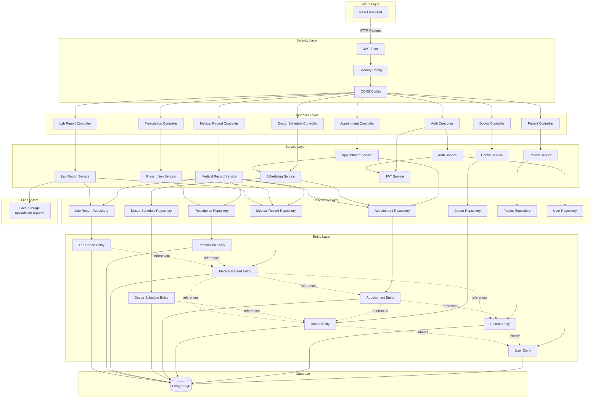

```mermaid
graph TB
    subgraph "Client Layer"
        Client[React Frontend]
    end
    subgraph "Security Layer"
        JWT[JWT Filter]
        SEC[Security Config]
        CORS[CORS Config]
    end
    subgraph "Controller Layer"
        AC[Auth Controller]
        PC[Patient Controller]
        DC[Doctor Controller]
        APC[Appointment Controller]
        DSC[Doctor Schedule Controller]
        MRC[Medical Record Controller]
        PRC[Prescription Controller]
        LRC[Lab Report Controller]
    end
    subgraph "Service Layer"
        AS[Auth Service]
        PS[Patient Service]
        DS[Doctor Service]
        APS[Appointment Service]
        SS[Scheduling Service]
        MRS[Medical Record Service]
        PRS[Prescription Service]
        LRS[Lab Report Service]
        JS[JWT Service]
    end
    subgraph "Repository Layer"
        UR[User Repository]
        PR[Patient Repository]
        DR[Doctor Repository]
        APR[Appointment Repository]
        DSR[Doctor Schedule Repository]
        MRR[Medical Record Repository]
        PRER[Prescription Repository]
        LRR[Lab Report Repository]
    end
    subgraph "Entity Layer"
        U[User Entity]
        P[Patient Entity]
        D[Doctor Entity]
        AP[Appointment Entity]
        DSE[Doctor Schedule Entity]
        MR[Medical Record Entity]
        PRE[Prescription Entity]
        LR[Lab Report Entity]
    end
    subgraph "Database"
        DB[(PostgreSQL)]
    end
    subgraph "File System"
        FS[Local Storage<br/>uploads/lab-reports/]
    end
    %% Client to Security
    Client -->|HTTP Request| JWT
    JWT --> SEC
    SEC --> CORS
    %% Security to Controllers
    CORS --> AC
    CORS --> PC
    CORS --> DC
    CORS --> APC
    CORS --> DSC
    CORS --> MRC
    CORS --> PRC
    CORS --> LRC
    %% Controllers to Services
    AC --> AS
    AC --> JS
    PC --> PS
    DC --> DS
    APC --> APS
    DSC --> SS
    MRC --> MRS
    PRC --> PRS
    LRC --> LRS
    %% Service Dependencies
    AS --> UR
    AS --> JS
    PS --> PR
    DS --> DR
    APS --> APR
    APS --> SS
    SS --> DSR
    SS --> APR
    MRS --> MRR
    MRS --> APR
    MRS --> PRER
    MRS --> LRR
    PRS --> PRER
    PRS --> MRR
    LRS --> LRR
    LRS --> MRR
    LRS --> FS
    %% Repositories to Entities
    UR --> U
    PR --> P
    DR --> D
    APR --> AP
    DSR --> DSE
    MRR --> MR
    PRER --> PRE
    LRR --> LR
    %% Entities to Database
    U --> DB
    P --> DB
    D --> DB
    AP --> DB
    DSE --> DB
    MR --> DB
    PRE --> DB
    LR --> DB
    %% Entity Relationships
    P -.inherits.-> U
    D -.inherits.-> U
    AP -.references.-> P
    AP -.references.-> D
    DSE -.references.-> D
    MR -.references.-> P
    MR -.references.-> D
    MR -.references.-> AP
    PRE -.references.-> MR
    LR -.references.-> MR
```
